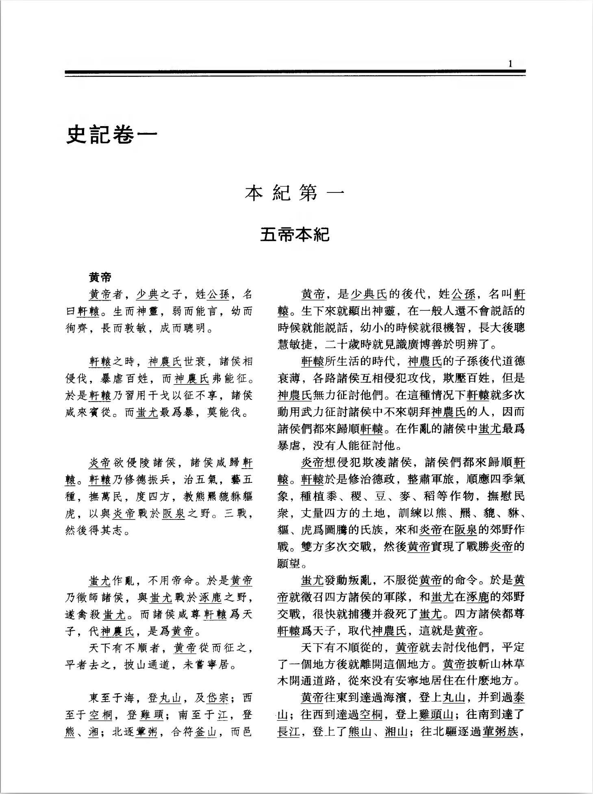

# 二十四史项目

## 目标

提取《二十四史全译》扫描版中全部原文译文信息，制作文言文-白话文对照数据集。

## 数据来源

[二十四史全译扫描版](https://archive.org/details/er-shi-si-shi-fan-yi/%E4%BA%8C%E5%8D%81%E5%9B%9B%E5%8F%B2%E5%85%A8%E8%AF%91)

[古籍印刷通用字規範字形表](http://www.homeinmists.com/Standard_glyph_list.htm)

## 工作流
1. ~~使用夸克全能王（🤯） OCR 得到 docx~~对于已经扫描好的影印 pdf 文件，使用夸克全能王会经过一个相当冗长的再扫描过程，不仅原 pdf 体积暴增，而且识别速度极慢且单次只能上传 500 页。而使用夸克网盘可以批量上传 pdf，然后运用网盘自带的转 docx 工具即可（二个工具调用的接口应该是相同的），这样速度更快。（夸克扫描王退钱！）
2. 解析 docx：
   OCR 得到的 docx 并不能完成全部版面恢复，比如居中格式实际上由缩进代替。通过分析我们有如下观察：
   1. 所有文本都是 paragraph 格式，没有其他特殊格式如 header 等。
   2. 页眉所在的段落有阿拉伯数字作为强特征，因此可以作为自然分页。
   3. 分页后，每页段落总是先排文言文，再排白话文。文言文段落群与白话文段落群都只有一个且连续互不交叉。但因为分页错落，同一段内容可能分隔到两页上。
   4. 每页第一段必然是文言文，最后一段必然是白话文，且这一段白话文是最后所见的文言文的译文。也就是说到每一页结束，文言文与白话文的正文段落数必然相同——（其中小节标题不计入，续篇续上开篇不重复计入）。这将帮助我们确定文言文与白话文的段落群分界。
   5. 文言文段落群中包含小节标题，小节标题的特征是仅占一行，左缩进不为 0，首行缩进为 None
   6. 正文段落的特征是左缩进为 0：其中开篇首行缩进不为 0，但续篇首行缩进为 None。所谓续篇就是被分隔到后一页上的段落。
   7. 我们需要识别并保留的文本格式及其相应特征：
        | 类   | 子类             | 特征 1: 左缩进 | 特征 2: 首行缩进 | 其他特征                         | 举例                                       |
        | ---- | ---------------- | -------------- | ---------------- | -------------------------------- | ------------------------------------------ |
        | 页眉 | 页眉             | \-             | \-               | 包含阿拉伯数字                   | 1                                          |
        | 标题 | 卷标题           | 0              | None             | 与页眉在同一 section 中          | 史記卷一                                   |
        |      | 章标题（标准化） | 很大           | None             | 与页眉在同一 section 中          | 本紀第一                                   |
        |      | 章标题（原题）   | 很大           | None             | 与页眉在同一 section 中          | 五帝本紀                                   |
        |      | 小节标题         | 较大           | None             | 夹杂于文言文正文中               | 黄帝                                       |
        | 正文 | 开篇             | 0              | 较大             | 每页文言正文与白话正文段落数相同 | 黄帝者，少典之子，姓公孫，名曰軒轅……       |
        |      | 续篇             | 0              | None             |                                  | 于涿鹿之阿。遷徙往來無常處，以師兵爲營衛…… |

---

## 工作流（弃用）

1. 版面分析 (YOLOv8)
参考 [jiangnanboy/layout_analysis](https://github.com/jiangnanboy/layout_analysis)
    
    很快，效果也好。原仓库提供两个模型，轻量 yolov8n 与中量 yolov8m。GPU 每张图检测约 10ms。
    中量版划分更细但有识别区域嵌套问题，最终选择轻量版。
    不过有些排布较近的段落没有完全分割开来，因此需要后处理作文本行分割与单字分割。
    
    <details>
    <summary>弃用路线</summary>
    
    - [layout-parser](https://github.com/Layout-Parser/layout-parser)：detectron2 效果不好，主要是因为它没有在中文数据集上进行预训练。而中文数据集本身就比较少，这也增加了难度。
        
        > 该项目发完文章就不维护了，沽名钓誉耳。publish or perish？
        > 
    - [ppstructure](https://github.com/PaddlePaddle/PaddleOCR/blob/release/2.7/ppstructure/layout/README_ch.md)：非常垃圾。环境难配，屎山文档。
        
        > 能把文档也写成屎山，代码就更不用看了。这就是百度！
        > 
        
        </details>
        
2. 版面分析后处理
    1. 文本行分割
    2. 单字分割
        
        > 为什么采用单字分割？因为我想得到单字的概率值。此外由于需要重新训练模型，我手上又没有现成繁体中文数据集，只好自己制作，而单字数据集制作较容易。此外，网上一些 [现成工具](https://kandianguji.com/ocr) 的单字识别效果很好。尽管它们不开源，但说明单字识别非常值得一试。
        > 
        后处理没啥说的，纯粹雕花。因为缺乏数据集，所以作端到端的文本识别几乎不可能。
3. 文字识别
    
    我们采用单字识别路线：按照 [AstarLight/CPS-OCR-Engine](https://github.com/AstarLight/CPS-OCR-Engine) 的思路走。走单字识别路线的 OCR 实在太少了，根本搜不到，如同大海捞针。
    
    1. 数据生成
        1. 确定字表：取古籍印刷通用字規範字形表（2021 年）与 GBK 编码字符交集，这是因为按照原书印刷时间（2004 年），当时出版社使用的应该还是 GBK 编码字体，同时我们排除不应在古籍中出现的非大陆标准的中文字符（如日文、韩文汉字等）。
        2. 确定字体：通过 [相当粗糙的识别](https://www.likefont.com/)，原书使用字体应为：
            - 方正书宋 GBK：用于章名与白话文正文
            - 方正仿宋 GBK：用于文言文正文
            - 方正黑体 GBK：用于卷名与小节标题
            - 方正楷体 GBK：用于页眉（忽略不计）
            - 方正准圆繁体：用于章名
            准圆繁体免费非商用。其余均可免费商用。
            <details>
            <summary>书影</summary>
            
            
            
            </details>
            
        3. 合成单字数据集：
            使用 [脚本](https://github.com/AstarLight/CPS-OCR-Engine/blob/master/ocr/gen_printed_char.py) 进行数据增强。
            ```
            python gen_printed_char.py --out_dir ./data/chars --font_dir ./data/fonts/training --dict_path ./data/dicts/labels.pkl --width 64 --height 64 --margin 8 --rotate 30 --rotate_step 1 --need_aug
            ```
            此外字体方面的数据增强如下：
              - 书宋、仿宋：全部字符（共 12328 个字符）
              <!-- - 黑体：一级字对应的繁体字符 -->

    <details>
    <summary>弃用路线</summary>
    
    - [CnOCR](https://github.com/breezedeus/CnOCR?tab=readme-ov-file#%E7%B9%81%E4%BD%93%E4%B8%AD%E6%96%87%E8%AF%86%E5%88%AB)：原生模型不支持繁体中文，外部模型用的是 chinese_cht_PP-OCRv3，表现依旧拉胯。
    - [tesseract](https://github.com/tesseract-ocr/tesseract)：懒得试了，主要看到它的 [繁体中文数据集字典](https://github.com/tesseract-ocr/langdata/blob/main/chi_tra/chi_tra.wordlist) 一堆英文和不知所云的东西，就觉得它的 LSTM 又慢又多余。
    
    </details>
    

## 实验
- 虽然验证集上识别率很高，但实际识别率仍然很低。猜测原因有二：1. 类别过多。2. 数据增强不符合实际数据噪声（旋转、盐噪声），实际得到单字分割的文本经过校正后旋转偏移小、同时不存在盐噪声——即扫描件只会引入蚀刻噪声，应当考虑用形态学随机在边缘像素作蚀刻）

## TODO

- 改变数据增强方法，缩小支持字符类别（一、二级核心字），重新训练数据。

- 补全版面重建代码

## GPU 配置

RTX2000 Ada 8G